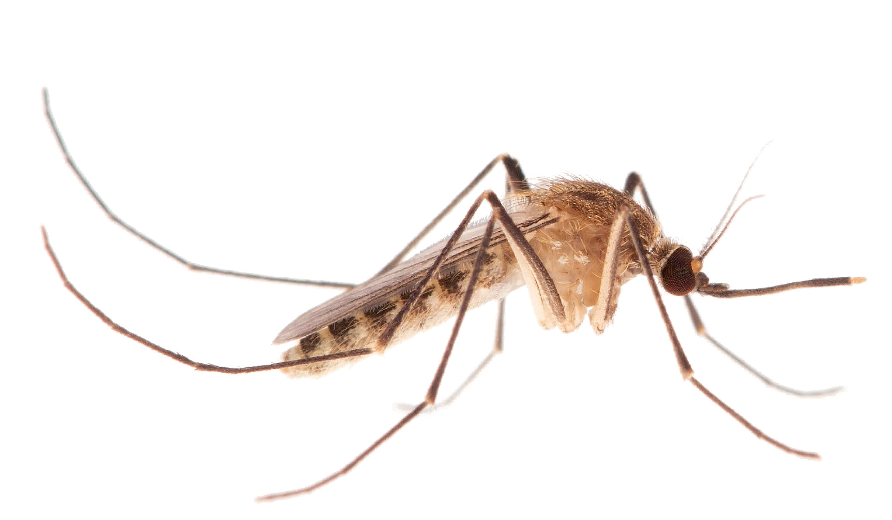

Data and scripts associated with **Haba et al. (2025) Ancient origin of an urban underground mosquito** (PMID: 39975080 / https://www.biorxiv.org/content/10.1101/2025.01.26.634793).



## Overview

This repository contains the computational pipeline and reference data used for population genomic analysis of *Culex pipiens* complex mosquitoes, focusing on the evolutionary history and origin of urban underground populations (*Culex molestus*).

## Repository Structure

```
├── README.md                    # This file
├── data/                        # Reference genome and annotation files
│   ├── GCF_015732765.1_VPISU_Cqui_1.0_pri_paternal_genomic.gtf.gz
│   ├── GCF_015732765.1_VPISU_Cqui_1.0_pri_paternal_rm.out.gz
│   ├── PipPop.accessible_sites.bed
│   ├── Table S1 Sample Metadata.xlsx
│   └── Table S2 Museum specimens collected in London.xlsx
├── scripts/                     # Analysis pipeline scripts
│   ├── README.md               # Detailed pipeline documentation
│   ├── 0. qc_and_mapping.sh    # Quality control and read mapping
│   ├── 1. variant_calling.sh   # Variant calling and filtering
│   ├── 2. kinship_ngsRelate.sh  # Kinship analysis
│   ├── 3. phasing.sh           # Haplotype phasing
│   └── 4. popgen_analyses.sh   # Population genomics analyses
└── images/                      # Figures and images
    └── Cpip_Complex_F.LawrenceEReeves.jpg
```

## Data Access

### Raw Sequencing Data
- **NCBI BioProject**: [PRJNA1209100](https://www.ncbi.nlm.nih.gov/bioproject/PRJNA1209100)
- **Data Type**: Paired-end Illumina whole genome sequencing
- **Samples**: 840 individual mosquitoes from global populations

### Reference Genome
- **Assembly**: *Culex quinquefasciatus* CpipJ5 (NCBI RefSeq: GCF_015732765.1)
- **Files provided in this repository**:
  - Reference genome: `GCF_015732765.1_VPISU_Cqui_1.0_pri_paternal_genomic.fna`
  - GTF annotation: `GCF_015732765.1_VPISU_Cqui_1.0_pri_paternal_genomic.gtf.gz`
  - Repeat regions: `GCF_015732765.1_VPISU_Cqui_1.0_pri_paternal_rm.out.gz`
  - Accessible sites: `PipPop.accessible_sites.bed`

## Analysis Pipeline

The analysis consists of 5 sequential scripts that process raw sequencing data through to population genomic analyses:

1. **Quality Control & Mapping** (`0. qc_and_mapping.sh`)
   - FastQC quality assessment
   - Trimmomatic adapter removal and quality trimming
   - BWA-MEM alignment to reference genome
   - Picard duplicate marking
   - GATK indel realignment
   - Coverage analysis with mosdepth

2. **Variant Calling** (`1. variant_calling.sh`)
   - bcftools variant calling in genomic chunks
   - Quality filtering (QUAL>30, MQ>40, <25% missing data)
   - Repeat masking
   - Accessible site extraction
   - Linkage disequilibrium pruning

3. **Kinship Analysis** (`2. kinship_ngsRelate.sh`)
   - Relatedness estimation using ngsRelate

4. **Haplotype Phasing** (`3. phasing.sh`)
   - Read-based prephasing with HAPCUT2
   - Statistical phasing with SHAPEIT4
   - Phasing quality assessment

5. **Population Genomics** (`4. popgen_analyses.sh`)
   - Principal component analysis (PCAngsd)
   - f3/f4 statistics (Treemix, Dsuite)
   - Nucleotide diversity analysis (pixy)
   - Demographic history inference (MSMC2)

## Getting Started

1. **Download raw data**: Access FASTQ files from NCBI project PRJNA1209100
2. **Clone this repository**: `git clone [repository-url]`
3. **Install dependencies**: See `scripts/README.md` for software requirements
4. **Configure scripts**: Modify file paths and parameters in each script
5. **Run pipeline**: Execute scripts sequentially (0 → 1 → 2 → 3 → 4)

For detailed instructions, see `scripts/README.md`.

## Contact

For questions about the analysis pipeline or data, please contact:
- Yuki Haba: [yhaba@princeton.edu]
- Lindy McBride: [csm7@princeton.edu]
